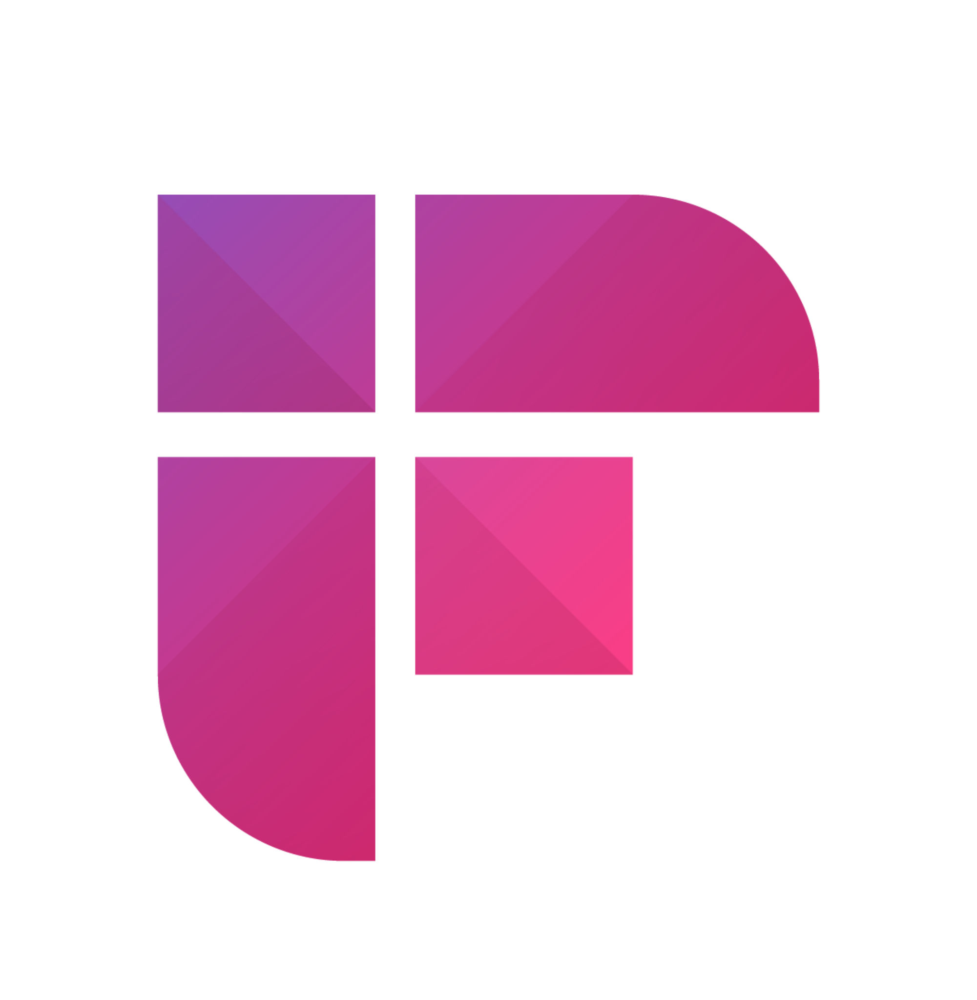

<p align="center">
  <a href="https://app.airweave.ai" target="_blank" rel="noopener noreferrer">
    <picture>
      <source media="(prefers-color-scheme: dark)" srcset="frontend/public/logo-airweave-darkbg.svg"/>
      <source media="(prefers-color-scheme: light)" srcset="frontend/public/logo-airweave-lightbg.svg"/>
      
    </picture>
  </a>
</p>

<p align="center">Open-source context retrieval layer for AI agents and RAG systems.</p>

<p align="center">
  <a href="https://app.airweave.ai" target="_blank"></a>
  <a href="https://docs.airweave.ai" target="_blank"></a>
  <a href="https://x.com/airweave_ai" target="_blank"></a>
  <a href="https://cursor.com/link/prompt?text=Help%20me%20set%20up%20Airweave%20locally.%20Follow%20these%20steps%3A%0A%0A1.%20First%2C%20verify%20Docker%20is%20installed%20and%20running%3A%0A%20%20%20docker%20--version%0A%20%20%20docker%20info%0A%0A2.%20Clone%20the%20repository%3A%0A%20%20%20git%20clone%20https%3A%2F%2Fgithub.com%2Fairweave-ai%2Fairweave.git%0A%20%20%20cd%20airweave%0A%0A3.%20Start%20Airweave%3A%0A%20%20%20.%2Fstart.sh%0A%0A4.%20The%20script%20will%20automatically%3A%0A%20%20%20-%20Create%20.env%20from%20.env.example%0A%20%20%20-%20Generate%20required%20secrets%20%28ENCRYPTION_KEY%2C%20STATE_SECRET%29%0A%20%20%20-%20Start%20all%20services%20with%20health%20checks%0A%20%20%20-%20Optionally%20prompt%20for%20OpenAI%2FMistral%20API%20keys%0A%0A5.%20Wait%20for%20all%20services%20to%20be%20healthy%20%28this%20may%20take%202-3%20minutes%20on%20first%20run%29%0A%0A6.%20Verify%20the%20app%20is%20accessible%20at%20http%3A%2F%2Flocalhost%3A8080%0A%0AIf%20there%20are%20any%20errors%2C%20help%20me%20troubleshoot%20them.%20Common%20issues%3A%0A-%20Port%20already%20in%20use%20%288080%2C%208001%2C%205432%2C%206333%2C%206379%2C%207233%2C%208081%2C%208088%29%0A-%20Docker%20not%20running%0A-%20Check%20logs%3A%20docker%20logs%20airweave-backend%20or%20docker%20logs%20airweave-frontend%0A%0AUseful%20commands%3A%0A-%20.%2Fstart.sh%20--restart%20%28restart%20services%29%0A-%20.%2Fstart.sh%20--skip-frontend%20%28backend%20only%29%0A-%20.%2Fstart.sh%20--destroy%20%28clean%20up%20everything%29"></a>
</p>

<p align="center">
  <a href="https://github.com/airweave-ai/airweave/actions/workflows/code-quality.yml"></a>
  <a href="https://github.com/airweave-ai/airweave/actions/workflows/eslint.yml"></a>
  <a href="https://github.com/airweave-ai/airweave/actions/workflows/test-public-api.yml"></a>
  <a href="https://pepy.tech/projects/airweave-sdk"></a>
  <a href="https://discord.gg/gDuebsWGkn"></a>
</p>

<p align="center">
  <video width="100%" src="https://github.com/user-attachments/assets/995e4a36-3f88-4d8e-b401-6ca43db0c7bf" controls></video>
</p>

### What is Airweave?
Airweave connects to your apps, tools, and databases, continuously syncs their data, and exposes it through a unified, LLM-friendly search interface. AI agents query Airweave to retrieve relevant, grounded, up-to-date context from multiple sources in a single request.

### Where it fits
Airweave sits between your data sources and AI systems as shared retrieval infrastructure. It handles authentication, ingestion, syncing, indexing, and retrieval so you don't have to rebuild fragile pipelines for every agent or integration.

### How it works
1. **Connect** your apps, databases, and documents (50+ integrations)
2. **Airweave** syncs, indexes, and exposes your data through a unified retrieval layer
3. **Agents query** Airweave via our SDKs, REST API, MCP, or native integrations with popular agent frameworks
4. **Agents retrieve** relevant, grounded context on demand

## Quickstart

### Cloud-hosted: [app.airweave.ai](https://app.airweave.ai)

<a href="https://app.airweave.ai"></a>

### Self-hosted

```bash
git clone https://github.com/airweave-ai/airweave.git
cd airweave
./start.sh
```

→ http://localhost:8080

> Requires Docker and docker-compose

## Supported Integrations

<!-- START_APP_GRID -->

<p align="center">





</p>

<!-- END_APP_GRID -->

<p align="center"><a href="https://docs.airweave.ai/connectors/overview"></a></p>

## SDKs

```bash
pip install airweave-sdk        # Python
npm install @airweave/sdk       # TypeScript
```

```python
from airweave import AirweaveSDK

client = AirweaveSDK(api_key="YOUR_API_KEY")
results = client.collections.search(
    readable_id="my-collection",
    query="Find recent failed payments"
)
```

<a href="https://docs.airweave.ai"></a>
<a href="https://github.com/airweave-ai/airweave/tree/main/examples"></a>

## Tech Stack

- **Frontend**: [React/TypeScript](https://react.dev/) with [ShadCN](https://ui.shadcn.com/)
- **Backend**: [FastAPI](https://fastapi.tiangolo.com/) (Python)
- **Databases**: [PostgreSQL](https://www.postgresql.org/) (metadata), [Vespa](https://vespa.ai/) (vectors)
- **Workers**: [Temporal](https://temporal.io/) (orchestration), [Redis](https://redis.io/) (pub/sub)
- **Deployment**: [Docker Compose](https://docs.docker.com/compose/) (dev), [Kubernetes](https://kubernetes.io/) (prod)

## Contributing

We welcome contributions! See our [Contributing Guide](CONTRIBUTING.md).

## License

[MIT License](LICENSE)

<p align="center">
  <a href="https://discord.gg/gDuebsWGkn">Discord</a> ·
  <a href="https://github.com/airweave-ai/airweave/issues">Issues</a> ·
  <a href="https://x.com/airweave_ai">Twitter</a>
</p>
