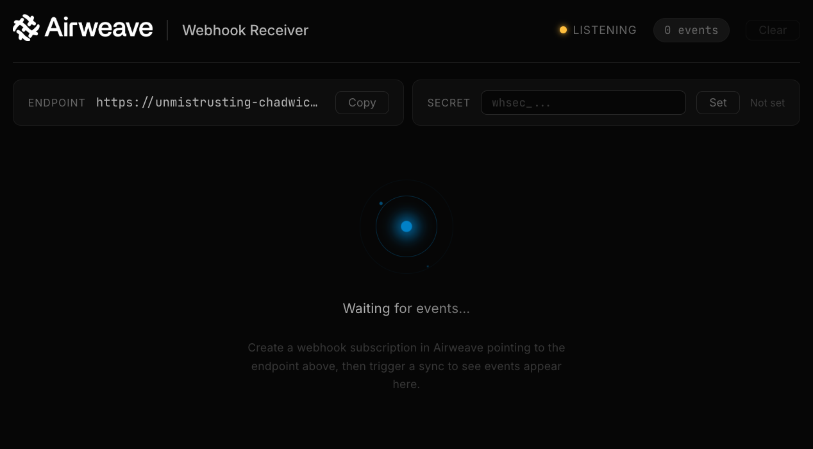

# Airweave Webhook Demo

A minimal FastAPI app that receives Airweave webhook events and streams them to a browser UI in real time via WebSocket. Useful for testing and debugging your webhook integration locally.



## Features

- Real-time event viewer in the browser (WebSocket-powered)
- Manual HMAC-SHA256 signature verification against Svix-signed deliveries
- Automatic ngrok tunnel detection for exposing your local server
- Rolling event log with clear functionality

## Quick start

```bash
cd examples/webhook-demo
pip install -r requirements.txt
uvicorn app:app --port 8000
```

Open [http://localhost:8000](http://localhost:8000) in your browser to see the event viewer.

## Exposing to the internet

Airweave needs to reach your endpoint to deliver webhooks. If you're running locally, use [ngrok](https://ngrok.com/) to create a public tunnel:

```bash
ngrok http 8000
```

The demo app auto-detects the ngrok tunnel on startup (via the ngrok local API at `http://127.0.0.1:4040/api/tunnels`) and displays the public URL in the browser UI.

## Creating a subscription

Once your server is running (and optionally exposed via ngrok), create a webhook subscription in Airweave pointing to your endpoint:

- **Local**: `http://localhost:8000/webhook`
- **With ngrok**: `https://<your-subdomain>.ngrok-free.app/webhook`

Airweave will send a verification ping to your endpoint before creating the subscription. The demo app responds with `200 OK` to all POST requests on `/webhook`, so verification will pass automatically.

## Signature verification

The demo app supports optional signature verification. To enable it:

1. Create a webhook subscription in Airweave (via the UI or API)
2. Retrieve the signing secret (`whsec_...`) from the subscription details
3. Paste the secret into the "Signing Secret" field in the browser UI

The app will then verify the `webhook-signature` header on every incoming delivery using HMAC-SHA256. Verified events show a green checkmark; failed verifications show a red warning.

### How verification works

Svix signs each delivery with: `HMAC-SHA256(base64decode(secret), "{msg_id}.{timestamp}.{body}")`

The demo app (`verify_signature()` in `app.py`):
1. Strips the `whsec_` prefix from the secret and base64-decodes it
2. Constructs the signed content as `"{msg_id}.{timestamp}.{body}"`
3. Computes the expected HMAC-SHA256 signature
4. Compares it against each `v1,<base64>` entry in the signature header

## Endpoints

| Method | Path | Description |
|--------|------|-------------|
| GET | `/` | Browser UI |
| POST | `/webhook` | Receive webhook events |
| POST | `/events` | Alias for `/webhook` |
| GET | `/api/endpoint-url` | Returns the best public URL (ngrok or localhost) |
| POST | `/api/secret` | Set or clear the signing secret |
| GET | `/api/secret` | Check if a secret is configured |
| DELETE | `/api/events` | Clear the event log |
| WS | `/ws` | WebSocket stream for real-time events |
